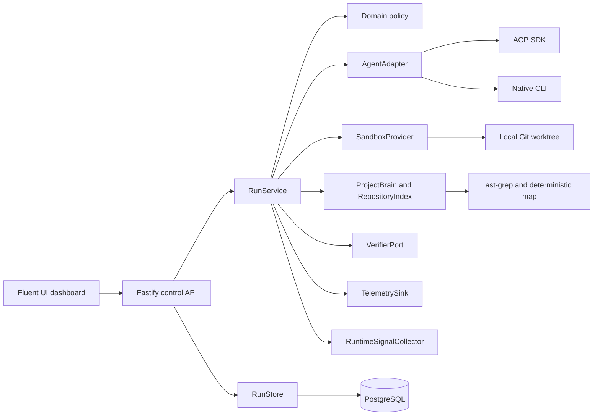

# Architecture

The harness is a modular TypeScript monolith. It deliberately wraps native coding agents instead
of replacing their planning, search, context management, or provider-specific capabilities.

## Dependency rule

`src/domain` has no framework imports. `src/application` coordinates domain ports. Fastify,
PostgreSQL, Git, process execution, SDKs, and external HTTP services live under `src/infrastructure`
or `src/server`. This keeps use cases testable with in-memory adapters.

## Core run flow

1. `RunService` persists a task and a `PROPOSED` run.
2. `AdaptiveModeController` starts with `GUIDED` unless a mode was explicitly requested.
3. `LocalWorktreeSandbox` creates a detached Git worktree at the requested revision.
4. `RepositoryIndex` and `ProjectBrain` build a small task-specific context.
5. A capability-preserving `AgentAdapter` runs the native agent.
6. `RuntimeSignalCollector` updates evidence snapshots at context, tool-event, diff, and verification
   checkpoints; the controller may change mode without altering the agent's native planning loop.
7. The harness captures an attempt-linked candidate diff and artifact.
8. `CommandVerifier` moves the candidate through `VERIFYING`. A failure may start one bounded repair
   with structured verifier evidence; every new candidate and verification is persisted.
9. Only a trusted verifier pass moves output to `VERIFIED`; exhaustion remains `QUARANTINED`.
10. Telemetry records cost, tokens, retry, latency, mode, changed files, verification, and adaptive
   signal dimensions.
11. Worktree retention is applied and `SandboxFinalized` is emitted.

Downstream mission nodes can consume only `VERIFIED` outputs.

## Agent adapters

- `ACPAdapter` uses the official stable ACP TypeScript SDK over NDJSON stdio. ACP keeps its native
  streamed updates and session identity. File callbacks are constrained to the sandbox path.
- `NativeCliAdapter` runs any NDJSON-capable native CLI without normalizing away its planning or
  context loop.
- `ClaudeCodeAdapter` consumes Claude Code's native stream-json output and preserves reported usage,
  cost, tool events, and cancellation.
- `APIAgentAdapter` is the API-agent extension point.

The fixture agents prove the native CLI and ACP paths without external credentials.

## Adaptive modes

- `STRICT`: narrow deterministic execution after scope stabilization.
- `GUIDED`: default compact starting context with unrestricted native repository search.
- `SOLO_NATIVE`: coherent native investigation for uncertain or highly coupled work.

Every transition is a persisted `ModeChanged` event with `from`, `to`, `reason`, structured evidence,
the triggering signal-snapshot ID, evidence IDs, and timestamp. Signals include dependency and
context expansion, touched modules, resolved cross-module import edges, changed files, verification
failure history, uncertainty, scope stabilization, and mechanical remaining work. `STRICT` is
reversible when deltas from its entry snapshot invalidate stabilization. Three observations of
cooldown block immediate re-narrowing or cumulative-signal escalation after a transition; explicit
new evidence may still leave `STRICT` immediately.

## Project Brain

`ProjectBrain` separates `FACT`, `INFERENCE`, `EVIDENCE`, and `DECISION`. A fact without evidence is
rejected. Records from a different source revision become `STALE`. The default index builds file,
symbol, resolved local import-relation, module-map, file-to-module ownership, and digest evidence.
Workspace/package roots (`workspaces`, simple pnpm workspace entries, `apps/*`, `packages/*`, and
`services/*`) take precedence. Single-package `src/*` layers and `src/features/*` feature roots form
bounded deterministic modules.
`OptionalCodebaseMemoryIndex` is an explicitly inactive optional port until a configured MCP/service
transport exists; its status exposes the deterministic local fallback and never claims a hidden
daemon connection.

## Durable state

PostgreSQL stores tasks, runs, events, artifacts, verifications, mode transitions, project knowledge,
credential references, telemetry, runtime-signal snapshots, user/session records, and mission graph
state. Tests use in-memory ports. Numbered migrations live under `migrations/` and run in order.

## Mission tree and project graph

`MissionTree` represents work flow, while `RepositoryIndex` represents code dependency flow.
`VerificationState` is the trust flow. `split`, `merge`, `promote`, and `collapse` are domain
operations. Dependency gates require `VERIFIED` state, regardless of an agent claiming completion.

## Replaceable upstream boundaries

Bifrost, Nango, Agent Vault, Langfuse, codebase-memory-mcp, and future Unkey deployment stay behind
ports or HTTP/protocol adapters. Controllers do not import vendor-specific modules. Exact audited
versions, licenses, and update procedures are in [docs/UPSTREAMS.md](docs/UPSTREAMS.md).
