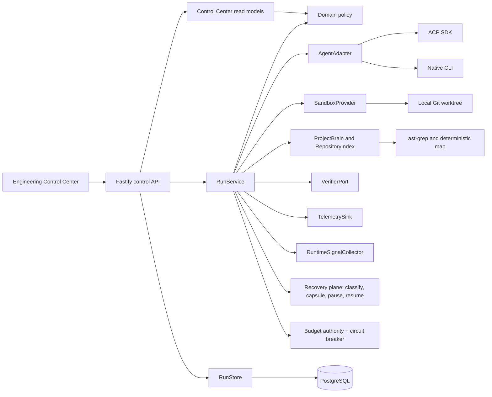

# Architecture

The harness is a modular TypeScript monolith. It deliberately wraps native coding agents instead
of replacing their planning, search, context management, or provider-specific capabilities.

## Engineering Control Center

Session 9 adds a derived human inspection surface. `/api/v1/control-center/*` read models project
Project, Work, Mission, Execution, Candidate, Verification, Evidence, Trust, Context, Cost, and
Delivery without exposing mutable domain objects or granting authority. Graph visualization is
navigation: a Project Map edge has `trustAuthority: NONE`. Optional providers (OSV, OpenGrep, SCIP,
OTLP, pricing catalog) report availability independently; their absence does not mark MAF unhealthy.
Work items are a minimum PM seam (built-in today, replaceable later) and cannot write trust,
verification, or promotion. Inspection depth defaults to SIMPLE. Why-explanations are recorded
events only — never a post-hoc LLM narrative. Generated UI is not shipped; any future generated
action must round-trip MAF command policy.

## Dependency rule

`src/domain` has no framework imports. `src/application` coordinates domain ports. Fastify,
PostgreSQL, Git, process execution, SDKs, and external HTTP services live under `src/infrastructure`
or `src/server`. This keeps use cases testable with in-memory adapters.

## Core run flow

1. `RunService` persists a task and a `PROPOSED` run.
2. `AdaptiveModeController` starts with `GUIDED` unless a mode was explicitly requested.
3. `LocalWorktreeSandbox` creates a detached Git worktree at the requested revision.
4. `RepositoryIndex` and `ProjectBrain` build a small task-specific context.
5. A capability-preserving `AgentAdapter` runs the native agent.
6. `RuntimeSignalCollector` updates evidence snapshots at context, tool-event, diff, and verification
   checkpoints; the controller may change mode without altering the agent's native planning loop.
7. The harness captures an attempt-linked candidate diff and artifact.
8. `CommandVerifier` moves the candidate through `VERIFYING`. A failure may start one bounded repair
   with structured verifier evidence; every new candidate and verification is persisted.
9. Only a trusted verifier pass moves output to `VERIFIED`; exhaustion remains `QUARANTINED`.
10. Telemetry records cost, tokens, retry, latency, mode, changed files, verification, and adaptive
   signal dimensions.
11. Worktree retention is applied and `SandboxFinalized` is emitted.

Downstream mission nodes can consume only `VERIFIED` outputs.

## Agent adapters

- `ACPAdapter` uses the official stable ACP TypeScript SDK over NDJSON stdio. ACP keeps its native
  streamed updates and session identity. File callbacks are constrained to the sandbox path.
- `NativeCliAdapter` runs any NDJSON-capable native CLI without normalizing away its planning or
  context loop.
- `ClaudeCodeAdapter` consumes Claude Code's native stream-json output and preserves reported usage,
  cost, tool events, and cancellation.
- `APIAgentAdapter` is the API-agent extension point.

The fixture agents prove the native CLI and ACP paths without external credentials.

## Adaptive modes

- `STRICT`: narrow deterministic execution after scope stabilization — bounded initial scope,
  minimal context, suited to mechanical known-scope work.
- `GUIDED`: default compact verified starting context with unrestricted native repository search.
- `SOLO_NATIVE`: coherent native investigation for uncertain or highly coupled work; MAF remains
  outside as observer/controller/verifier.

### Desired versus effective mode

A run tracks `desiredMode` (what the adaptive policy wants) separately from `effectiveMode` (what
is actually enforced on the current or next agent session). `executionMode` is a compatibility
mirror of `effectiveMode` and never shows unenforced desired state. Decisions are computed against
the desired mode; enforcement moves the effective mode only with evidence:

- `ModeChangeRequested` records intent with the planned enforcement strategy.
- `ModeChanged` records enforcement with `enforcement.method` and evidence.

Enforcement strategies (deterministic planner in `src/domain/policy-enforcement.ts`):

1. `SESSION_BOUNDARY` — no session is active; the next session starts under the new policy,
   with a context rebuilt for the new mode (`ContextRebuilt`).
2. `LIVE_UPDATE` — the agent declares `livePolicyUpdate`; the harness delivers a policy update to
   the running session and the mode becomes effective only after the session emits a matching
   `policy` acknowledgement event.
3. `SAFE_RESTART` — only for broadening transitions while a session is active, only when the agent
   declares `safeSessionRestart`, and bounded by `maxPolicyRestarts`; the session is restarted from
   the existing workspace with a rebuilt context and a continuation message.
4. `DEFERRED_BOUNDARY` — everything else; the change applies at the next safe execution boundary.
   Tightening transitions never restart a running session.

Every enforcement is a persisted `ModeChanged` event with `from`, `to`, `reason`, structured
evidence, enforcement method + evidence, the triggering signal-snapshot ID, evidence IDs, and
timestamp. Signals include dependency and context expansion, touched modules, resolved
cross-module import edges, changed files, verification failure history, uncertainty, scope
stabilization, and mechanical remaining work. `STRICT` is reversible when deltas from its entry
snapshot invalidate stabilization. Three observations of cooldown block immediate re-narrowing or
cumulative-signal escalation after a transition; explicit new evidence may still leave `STRICT`
immediately.

## Project Brain

`ProjectBrain` separates `FACT`, `INFERENCE`, `EVIDENCE`, and `DECISION`. A fact without evidence is
rejected, every record carries producer/source/digest provenance, and every read is page-bounded.
When `DATABASE_URL` is configured, `PostgresProjectBrain` uses the existing application pool and
the canonical `project_knowledge` table from migration 011; otherwise `InMemoryProjectBrain` keeps
local operation dependency-free. Deterministic record identity makes repeat observations
idempotent. Database errors propagate from the adapter and are emitted as explicit run events;
knowledge unavailability never changes verifier evidence, candidate trust, or merge eligibility.

Session 5's production write rule is intentionally narrow: only selected repository files carrying
an exact SHA-256 digest from `RepositoryIndex.indexScope()` enter the brain. Each file becomes an
`EVIDENCE` record, and each selected module gets a `FACT` referencing those evidence records. Raw
agent/model text, prompts, tool output, inferences, and unverified candidate claims are not inputs.
Records bind to the sandbox's resolved base commit, not a movable ref such as `HEAD`; records from a
different resolved source revision conservatively become `STALE` unless Session 6 provenance proves
their complete source independence. Project knowledge publication now uses one required atomic batch
boundary. The PostgreSQL adapter executes the batch in one transaction; the in-memory adapter stages
and validates the whole batch before swapping visible state. A failed batch publishes no partial
authoritative record, and deterministic identity keeps retries idempotent.

Session 6 adds a minimal deterministic compiled-knowledge base for module boundaries. Compiled facts
carry a canonical subject, file-digest inputs, and a path-derived module-membership digest. Resolution
rechecks those inputs against the live repository snapshot: changed inputs are `STALE`, unavailable
inputs are `UNKNOWN`, and incompatible current claims for one compiled subject are `CONFLICTED` and
withheld. Proven-independent records may remain current across an unrelated revision without being
rewritten or gaining authority. Records without sufficient provenance retain revision-global,
fail-closed behavior. Model summaries are not compiled or promoted by this phase.

`OptionalCodebaseMemoryIndex` is an explicitly inactive optional port until a configured MCP/service
transport exists; its status exposes the deterministic local fallback and never claims a hidden
daemon connection.

## Context budget and ledger

`GuidedContextBuilder` remains the starting-context builder, but its goal, module, file, symbol,
knowledge, evidence-reference, ledger-item, and total-character allowances are explicit in
`DEFAULT_CONTEXT_BUDGET`. The existing character/4 token figure remains only a labelled heuristic
(`CHARACTERS_DIVIDED_BY_4`), never an exact tokenizer result. `UNKNOWN` is used when a measurement is
not available. Knowledge reads request one bounded page; evidence references are deduplicated and
capped independently, with every partial result recorded rather than silently discarded.

Every rendered context emits a factual `ContextLedgerRecorded` event containing run/mission,
build stage, source revision, selected categories/items, inclusion reasons, exact character counts,
labelled token estimates, freshness, and truncation reasons. The ledger is deterministic telemetry,
not an agent-written explanation, and it carries no authority over assurance or trust state.

Session 6 promotes that initial selection into a mission-owned Working Set. Canonical
`ContextHandle`s reference bounded file, symbol, module, knowledge, evidence, or semantic-repository
targets without embedding their payload or a provider-owned symbol identifier. A semantic-repository
locator carries only the MAF source binding (project, revision, artifact digest/version, indexed time,
languages, and completeness). A handle is a locator only: every page
resolution rechecks project, revision, digest/membership freshness, scope, and availability.
`ContextNavigationService` reuses `RepositoryIndex.indexScope()` and the same snapshot digest cache;
it is not a second repository pager. Supported local pages are bounded file/symbol slices, observed
module import relationships, source-revalidated knowledge records, and their evidence references.
An optional `RepositoryIntelligenceProvider` may additionally resolve bounded symbol, definition,
reference, and implementation navigation pages. Provider schemas terminate in infrastructure; each
returned location is rebound to a canonical repository URI and exact current document digest before
it can enter the Working Set. The complete source binding and every provider field are runtime
validated; symbol anchors and returned files are independently re-digested, provider strings render
only as labelled untrusted JSON locator data, and the SCIP adapter retains only deterministic
bounded top-K results through a verified read-only file handle. Missing, stale, malformed,
timed-out, unsupported, version-mismatched, and partial provider states remain explicit rather than
becoming successful empty output.

Page requests are bounded independently by total request count, successful resident page count,
per-page characters/items, and total resident characters. Duplicate requests reuse the existing
page without duplication. Rejection, stale resolution, duplicate reuse, success, and explicit
budget exhaustion are factual Context Ledger events. Pages are always `CONTEXT_ONLY`; more context,
memory, or page success cannot set trust state, close assurance obligations, or change merge
eligibility. Token accounting now has an optional exact-counter seam; absent or unavailable exact
measurement retains the labelled `CHARACTERS_DIVIDED_BY_4` estimate, never an unlabeled guess or
fabricated zero.

## Project Graph: bounded incremental indexing

`RepositoryIndex.index()` is a cheap, unbounded, path-only pass — every tracked file (up to a
100 000-file safety ceiling, with an honest `filesTruncated` flag rather than a silent slice) plus
package/module ownership derived from paths alone. No file content is read, so it is safe to call
on every task regardless of repository size. `RepositoryIndex.indexScope()` performs the bounded,
expensive part — parsing symbols and resolved local `IMPORTS` relations for exactly the requested
files — and caches each file's parse by content digest so repeated calls during a run only do new
work for files that changed or were never seen before.

`RunService` calls `ContextBuilderPort.selectInitialScope()` on the cheap snapshot, scope-indexes
exactly that selected page, and renders once with the same `ContextSelection` plus real symbols.
This names and instruments the existing select-then-parse pager: scope-only calls do not read
ProjectBrain or construct throwaway text, and the render does not rank the whole module map again.
The same select-once/render-once sequence applies to a mode-driven context rebuild.
As the agent touches new files (tool events, diffs), `RunService` incrementally scope-indexes any
newly referenced files not yet parsed and grows the same snapshot instance; the enlarged snapshot
is threaded into subsequent `RuntimeSignalCollector` observations, so dependency-expansion and
cross-module-edge signals reflect real resolved relations for whatever has actually been touched,
never a frozen initial slice.

Package (`packageOwnership`) and architectural module (`moduleOwnership`) are tracked separately.
A package/workspace root (`workspaces`, simple pnpm workspace entries, `apps/*`, `packages/*`, and
`services/*`) is the outer unit; a `src/<layer>` or `src/features/<name>` convention within that
package forms a deeper architectural module (e.g. package `apps/web`, module
`apps/web/src/domain`), falling back to the package root when no such convention applies.
Relationship kinds stay deterministic: `IMPORTS` requires both a real resolved local specifier and
the target file to exist in the repository snapshot. Nothing derived from agent-claimed data is
ever labeled deterministic.

Session 8 keeps the deterministic local graph as the always-available correctness baseline and adds
semantic repository intelligence only as an optional cold-state capability. A configured SCIP
consumer reads an operator-generated, digest-pinned index plus a MAF-owned revision/document-digest
manifest; MAF never installs or runs an indexer automatically. More semantic graph data creates no
resident prompt material. One fixed repository locator may be present, and only an explicit bounded
Context Page request materializes locations. These graph observations can guide navigation and impact
exploration but cannot verify a candidate, satisfy an assurance obligation, or authorize merge.

## Recovery plane

Failure may interrupt progress; it must not destroy trustworthy progress. `src/domain/recovery.ts`
is pure domain logic: `classifyFailure` deterministically pattern-matches an error against a
`FailureClassification` taxonomy (`PROVIDER_TRANSIENT`, `PROVIDER_DEGRADED`, `RATE_LIMIT`,
`NETWORK_FAILURE`, `CREDENTIAL_FAILURE`, `AGENT_FAILURE`, `VERIFICATION_FAILURE`,
`ENVIRONMENT_FAILURE`, `BUDGET_EXHAUSTED`, `USER_INTERRUPT`, `REVISION_CONFLICT`,
`UNKNOWN_FAILURE`), defaulting honestly to `UNKNOWN_FAILURE` rather than guessing. Only a narrow
set of classes (`PROVIDER_TRANSIENT`, `PROVIDER_DEGRADED`, `RATE_LIMIT`, `NETWORK_FAILURE`,
`AGENT_FAILURE`) are auto-retryable; everything else requires explicit resume or escalation.

`RunService` wraps every agent attempt in a bounded recovery loop: an auto-retryable failure gets
one new bounded session (never a resume into the session that just failed) up to
`maxRecoveryAttempts` per run. Anything that exhausts retries, or is not auto-retryable, propagates
to `execute()`'s outer catch, which builds a `RecoveryCapsule` — run/task identity, goal, base and
resolved revision, workspace path, agent/provider/mode state, cost spent, candidate lineage, the
strongest verified candidate, verified facts/decisions, and the classified failure reason — and
persists it durably (`RunStore.saveRecoveryCapsule`) before moving the run to `PAUSED`. A capsule
never carries hidden chain-of-thought, only already-structured evidence the system already tracked.
`PAUSED` carries strictly more information than a bare `FAILED` and is used whenever a capsule was
successfully captured; `FAILED` is reserved for the rare case where capsule-building itself fails.

Candidate lineage (`candidateLineage`, `strongestCandidate`) is reconstructed read-only from
already-persisted artifacts and verifications — nothing is ever deleted, so a failed later repair
can never cause an earlier better-verified candidate's *identity and verification result* to be
forgotten. This is a metadata-level guarantee, not a content one: the full diff for a candidate is
only durably stored as a preview truncated to `maxDiffPreviewChars` (12,000 characters by default),
and the worktree's on-disk files reflect only the latest attempt. If a stronger earlier candidate's
diff exceeded that preview and a later, worse attempt has since overwritten the working tree,
`strongestCandidate` still correctly identifies *which* candidate was strongest, but reapplying its
full content is not guaranteed — physical workspace rollback is not implemented.

`RunService.resume()` restarts a `PAUSED` run from its capsule in the preserved worktree (default
retention keeps any non-`VERIFIED` sandbox). Before trusting prior evidence it re-resolves the
capsule's requested revision in the *source* repository and compares it against what the capsule
recorded when it was captured — the frozen worktree cannot itself drift, so the conflict to detect
is the source repository moving on while the run was paused. A mismatch refuses to resume
(`REVISION_CONFLICT`) rather than silently continuing on stale ground.

`RunService.emergencyStop()` cancels every active run — preserving worktrees, evidence, and
candidate lineage exactly as a normal cancellation does — and blocks new run creation until
`resumeNewRuns()` is called. It is a pause, never a wipe. The decision is DURABLE: it is written to
`harness_control_state` before the cancellation sweep begins and re-read before any run is created
or resumed, so a process restart cannot revoke a stop nobody decided to lift. Resuming a paused run
also restores the recovery and policy-restart counters the run had already consumed
(`RecoveryCapsule.safetyCountersUsed`), so a per-run safety limit cannot be reset by repetition.

Explicitly not implemented, stated rather than overclaimed: automatic reload/resume of `PAUSED`
runs after a server process restart (capsules persist across a restart when using the PostgreSQL
store; nothing yet re-triggers resume automatically), and provider/model failover beyond a new
session on the same configured adapter (only one native adapter is wired today).

## Budget authority

`src/domain/budget.ts` is pure domain logic. A task may carry an optional `budget: { mode, limitUsd }`;
absent means fully permissive — nothing to enforce, and every authorization check trivially passes.
`computeAllocation` splits a configured limit into `execution`/`verification`/`recovery` reserves
(default 60/25/15%) so a runaway execution can never consume the money reserved for mandatory
verification or bounded recovery; `authorizeSpend` checks one category's remaining reserve against
its recorded spend (mapped from the existing `CostBreakdown` fields — no new cost tracking was
needed). `ADVISORY` mode never blocks, only reports an overrun; `HARD` mode blocks once a category's
reserve is exhausted. An unconfigured budget or an unauthorized-but-advisory spend is reported as
`null`/`false`, never as `$0` or a silent pass.

`RunService` enforces three gates: before the very first agent session (refuses to start at all —
the M4C "do not execute" strategy — if even the execution reserve cannot fund it, going straight to
a `BudgetExhaustedError`-classified capsule and `PAUSED`), before each bounded repair attempt
(stops repairing — never upgrades the last verification result, so budget reduces scope without
ever silently reducing trust), and before each bounded recovery retry (skips the retry rather than
spending on it). `estimateFromHistory` produces a bounded cost range anchored to prior
cost-per-verified-success telemetry, with `MEDIUM` confidence — genuinely `null` (not a guess) when
no history exists yet. `BudgetAllocated` and `CostEstimated` events are emitted at run creation so
this is inspectable without a dedicated API surface.

Not yet implemented: literal request-level interception for CLI-spawned native agents (their own
provider calls happen inside the child process, outside MAF's process boundary — orchestration-level
gating, described above, is what is actually enforceable for this execution model); project-level
(cross-run, cumulative) budgets — today's budget is per-run only, matching the milestone's stated
minimum.

Cost accounting itself still ultimately depends on `costUsd` the agent process self-reports in its
`usage` events — the same trust boundary M3 already applies to agent-reported error text applies
here too, and enforcement (this milestone) is what actually gives that number teeth. A reported
value is sanitized before being trusted: negative, non-finite, or implausibly large (over
`maxPlausibleSingleEventCostUsd`, currently $1,000) single-event costs are rejected rather than
applied (visible via an `ImplausibleCostIgnored` event), which closes the two concrete abuse
shapes a bad value can cause — driving spend negative, or forcing an immediate self-inflicted
pause. It does **not** close, and cannot without an independently metered provider gateway, an
agent that simply always under-reports (e.g. always claims near-zero) to keep a HARD budget from
ever triggering. A poisoned cost figure also feeds `costPerVerifiedSuccess()` and therefore
`estimateFromHistory`'s range for future runs.

## Provider circuit breaker

`src/domain/circuit-breaker.ts`'s `ProviderCircuitBreaker` is deterministic threshold-and-cooldown
arithmetic — no model is ever consulted to judge provider health. States are `HEALTHY`, `DEGRADED`
(past a failure threshold but still attempting), `OPEN_CIRCUIT` (fast-fails every attempt),
`HALF_OPEN` (exactly one bounded probe attempt allowed once the cooldown elapses). `RunService`
checks `canAttempt()` before every agent-session attempt (initial or retry) and refuses immediately
— without ever calling the adapter — when the circuit is open, so an obviously failing provider is
not retried into the ground. Only provider/network-shaped failure classifications
(`PROVIDER_TRANSIENT`, `PROVIDER_DEGRADED`, `RATE_LIMIT`, `NETWORK_FAILURE`) count against a
provider's health — agent-code-quality or verification failures are a different concern with a
different owner and never affect the breaker. One breaker instance is shared across all runs in a
process, so a provider that just failed for a previous run starts the next run already `DEGRADED`.
A HALF_OPEN probe's outcome always releases its slot one way or the other — via `recordOutcome()`
when it's provider-health-relevant, or `releaseProbe()` when it isn't — so an ordinary agent
failure landing mid-probe can never permanently wedge the circuit open.

Honest applicability: because M3's `AgentReportedFailure` classifies every agent-reported error as
`AGENT_FAILURE` regardless of its text (agent output is never trusted to self-classify), a real
provider outage that a CLI-spawned native agent encounters *inside its own process* surfaces to
MAF as an ordinary agent error, not a provider-classified one — the breaker never sees it. In the
one-adapter-today reality, the breaker is genuinely exercised only by failures the harness/adapter
layer itself raises (e.g. `agent.start()` throwing before any agent process even exists to report
from). It is real, tested, and will matter as soon as a harness-mediated provider path (e.g. a
`ModelGateway`-backed adapter) exists; it does not yet protect against a real outage a CLI agent
silently absorbs and reports as its own failure.

## Task risk profiler and assurance planner

`src/domain/risk.ts` derives a `RiskVector` — ten independent dimensions
(`ReasoningDifficulty`, `CodeCoupling`, `BlastRadius`, `ArchitectureSensitivity`, `DebtRisk`,
`SecuritySensitivity`, `PerformanceSensitivity`, `OperationalSensitivity`, `NetworkBoundaryChanges`,
`DataConsistencyRisk`), never a collapsed scalar score. Each dimension carries a `level`
(`LOW`/`MEDIUM`/`HIGH`) and a `provenance`: `DETERMINISTIC` when derived from real repository
evidence (distinct modules/packages touched via M2's ownership maps, resolved cross-module
`IMPORTS` edges via M2's relations graph, a path-pattern match), `HEURISTIC` when only a weaker
path-pattern proxy is available and nothing matched (so the honest default is "probably not", not
a guessed level), and `INSUFFICIENT_EVIDENCE` for dimensions that have no deterministic source yet at a given stage
(`ReasoningDifficulty` always; `DebtRisk` only pre-execution, since M7A's declared-debt checker made
it `DETERMINISTIC` once a diff exists) — reported as such rather than guessed.
`CodeCoupling`/`BlastRadius`/`ArchitectureSensitivity` specifically degrade their own provenance
(`coverageProvenance` in risk.ts) based on how many touched files actually have module/package
ownership entries: full coverage stays `DETERMINISTIC`, partial coverage degrades to `HEURISTIC`,
and zero coverage (e.g. a migration- or infra-only diff, since M2's ownership maps only cover
parsed source files) becomes `INSUFFICIENT_EVIDENCE` — a confident "LOW" would otherwise
misrepresent having no visibility as having checked and found nothing. No model is ever called to
assess risk.

`src/domain/assurance.ts`'s `buildAssurancePlan` compiles a `RiskVector` plus the task's
`qualityPreference` (`FAST`/`BALANCED`/`HIGH`/`CRITICAL`, defaulting to `BALANCED`) into an
`AssurancePlan`: a deterministic rule table (not a model call) deciding which of nine checks
(`CORRECTNESS`, `INTEGRATION`, `ARCHITECTURE`, `DEBT`, `SECURITY`, `PERFORMANCE`, `CONCURRENCY`,
`RESILIENCE`, `INDEPENDENT_REVIEW`) are required, with a reason recorded for every check —
required or not, never silent. `CORRECTNESS` is always required (the existing trusted-verifier
baseline every candidate already goes through); higher risk or a higher quality preference expands
the required set (`RESILIENCE` is required by either `NetworkBoundaryChanges` or
`OperationalSensitivity` reaching `MEDIUM`, not network-boundary evidence alone); `INDEPENDENT_REVIEW`
only becomes required when `SecuritySensitivity` is `HIGH` *and* the preference is `CRITICAL` — the
M5A rule that a high-risk author must not be the sole judge of its own high-risk work. `HIGH` and
`CRITICAL` preferences are deliberately not treated identically everywhere: `HIGH` alone expands
only `INTEGRATION`, while `SECURITY`/`RESILIENCE` expand only at `CRITICAL` — forcing every
`HIGH`-preference task through a security check regardless of actual risk would defeat "a small,
low-risk change gets a small plan."

`RunService` computes and emits both twice per run, as `RiskProfiled`/`AssurancePlanned` events so
the plan is inspectable evidence, never a hidden internal value: once right after `ContextBuilt`,
from the context builder's selected `initialFiles` (a pre-execution estimate — the only thing
available before any diff exists), and again from the actual diff's `changedFiles` after
`captureCandidate` resolves one (ground truth, refining the estimate with what was actually
touched rather than what was expected to be). M9's diff-captured vector additionally scans concrete
DB/query, pagination/index, network, bundle, serialization, payload, hot-path, and memory signals;
ordinary work with no such evidence remains LOW rather than being labeled performance-sensitive.

Two of the plan's checks gained deterministic checkers at M7, both reading the candidate's own
unified diff (parsed by `src/domain/diff-parse.ts`): `DEBT` (M7A) — `src/domain/debt.ts` counts
word-bounded declared-debt markers (`TODO`/`FIXME`/`HACK`/`XXX`) in the diff's added vs removed
lines of source files; net ≤ 0 passes, a small positive delta warns, and net ≥ 5
(`DEBT_FAIL_THRESHOLD`) fails. At the diff-captured stage the same counts feed `DebtRisk`
(`DETERMINISTIC`; net ≥ 2 `MEDIUM`, ≥ 5 `HIGH`), which is what makes the plan require `DEBT`.
`ARCHITECTURE` (M7B) — `src/domain/architecture.ts` enforces the layering rule that `src/domain`,
the innermost layer, must not add an import resolving outside itself; a violation is reported as
`FAIL` on the Architecture quality dimension whether or not the plan required the check, and since
the pass-#4 trust kernel it also BLOCKS whether or not the plan required it (see "Trust kernel"
below: any deterministic FAIL raises its own obligation). Both checkers analyze added lines only — a removed
violation or a paid-down marker is improvement, not a new finding.

`SECURITY` gained its checker at M8A: `src/domain/security.ts` scans the diff's added lines (all
file types — secrets live in `.env`/yaml/json, not just source) for credential patterns, in both
quoted source form and unquoted `.env`/yaml `key=value` form. A match against a structured secret
format (AWS permanent/temporary access key ID, GitHub/Slack token, private key block) in a
production file is
deterministic evidence of a leak — `FAIL` on the Security quality dimension, reported whether or
not the plan required the check, and (uniquely among the dimensions) gating unconditionally: plan
requirements are path-keyword heuristics, and a leak written to an unkeyworded path must not pass
the gate on that technicality. Structured matches
confined to test/fixture files and generic literal assignments to credential-shaped names in
production files are `WARN` (checked, flagged); dummy credentials confined to tests pass with
disclosure; placeholders and references (`process.env.*`, `${...}`, `<...>`) are not literals.
Every finding is redacted before it becomes evidence — prefix + `…(redacted)` — and two further
layers guard the harness's own records. `redactSensitiveData` is applied to untrusted event,
verifier, hint, and telemetry values: secret-shaped keys are replaced wholesale unless their value
is a validated `credential://` locator or known capability label, structured token formats and
generic credential assignments (including config namespaces, quoted/template passphrases, Go
short assignments, and YAML block scalars) are replaced
in strings, and an entire PEM private-key
block (header, unsigned body, and footer) is suppressed as one unit. Its search expressions are
stateless; repeated values and adjacent files cannot influence one another through `RegExp.lastIndex`.
The persisted artifact preview, repair prompt, and independent-review prompt are built with
`redactPatchPreview`, which suppresses every added line of each file whose additions carry
credential-shaped content. Token-only redaction is insufficient for a private key because its body
lines have no standalone signature. Uninspectable `GIT binary patch` payloads are also removed from
the persisted preview rather than retained in reversible form. The Security quality dimension for
such a candidate is `NOT_CHECKED`, not PASS. Gitlink and rename/copy-only changes receive the same
honest state because their complete destination bytes are not present in the patch; when the
assurance plan requires Security, that state blocks promotion. The composed agent → diff →
artifact/event/telemetry/API path is regression-tested
with consecutive and encrypted private-key files, inline and repeated credential assignments,
binary/uninspectable diffs, raw verifier output, adversarial filenames and references, mode reasons,
and secret-bearing task/error text. Recovery capsules retain candidate identity and digest metadata
rather than diff-preview content, and sanitize their goal, failure detail, facts, decisions, and
operational locators. Create/resume reject raw agent credential inputs and create rejects
secret-bearing durable locators. These controls reduce retention in known harness persistence
paths; they do not prove that arbitrary native agent processes, external verifier commands, or
sandbox files cannot disclose a secret outside the harness. `Security` joined the gated dimensions
at M8B.

`PERFORMANCE` gained its M9 checker without pretending code inspection is a benchmark.
`src/domain/runtime-graph.ts` derives a Runtime Graph distinct from M2's Project Graph and emits it
as candidate/digest-bound evidence; only topology and edge attributes present in changed paths/code
are represented, while timeout/retry/auth/rate-limit/payload/consistency properties remain null when
unknown. Nodes require content evidence (SQL shapes, named technologies like redis/s3, actual
fetch/axios calls) — filenames and generic identifiers (`cache.ts`, a local `Map`, `fs.writeFile`,
a variable named `database`) do not fabricate deployment topology. A server-side network call
becomes ownership-unknown `SERVICE` unless the diff explicitly
identifies an external API; a URL alone does not prove organizational ownership. Sensitivity
signals are calibrated so one ubiquitous weak line (a lone `JSON.parse`) stays LOW, while
removing query bounds/schema structure counts as evidence even though only removed lines changed.
When the plan
requires Performance, `CommandPerformanceVerifier` runs one project-supplied
bounded numeric command in an ephemeral detached baseline worktree and the candidate worktree for a
bounded sample count. `src/domain/performance.ts` compares the measured delta against the task's
`maxRegressionPercent`. Missing infrastructure/specification, command failure, dirty or mismatched
baseline, zero/non-finite metrics, stale candidate/digest binding, or benchmark workspace mutation
is `NOT_CHECKED`, never PASS; required `NOT_CHECKED` and measured FAIL both gate promotion. Plan-
exempt ordinary work does not run the command. `ReasoningDifficulty` remains `INSUFFICIENT_EVIDENCE`
for every run until a real source exists (nothing is planned yet for it).

`RESILIENCE` gained its M10 checker. `src/domain/resilience.ts` derives which production-like failure
scenarios are relevant to a candidate deterministically from the diff's added code content only —
outbound dependency calls imply the network family (high latency, timeout, connection reset,
malformed upstream response, rate limiting), consistency-critical write paths imply duplicate
request, concurrent completion paths imply out-of-order response, and a plan requiring
`CONCURRENCY` forces the interleaving pair. Comments, filenames, and test/fixture/script paths are
not evidence. When no scenario is relevant, the verdict is a deterministic PASS (the diff itself
shows there is nothing to inject) — but only when the relevance scan could actually read every
changed file. The scan reads code files; it never opens a Compose file, Kubernetes manifest,
Terraform plan, CI workflow or `.env`. When a candidate changes such an artefact, a relevance-empty
(or even a fully-passing measured) result is reported `NOT_CHECKED`, because a scan of the CODE
cannot discharge a concern the OPERATIONAL artefact raised. When the plan requires Resilience and scenarios are relevant,
`CommandResilienceVerifier` runs one project-supplied trusted command once per scenario with
`MAF_RESILIENCE_SCENARIO` set, optionally bringing up and tearing down a bounded Docker Compose
environment (120s, no Kubernetes). The measurement is bound to the candidate id and diff digest;
the workspace digest is re-collected afterwards so any mutation invalidates the evidence. Missing
specification or verifier, stale binding, an unexecuted relevant scenario, or a failed scenario is
`NOT_CHECKED`/`FAIL`, never PASS, and both gate promotion. Evidence records verbatim that local
scenario execution is resilience evidence, not production verification. `DURABLE_VERIFIED`
additionally requires a MEASURED resilience PASS — the plan's relevant scenarios were actually
executed against this candidate and passed; a heuristic relevance-empty PASS (the diff shows
nothing to inject) caps the rung at `QUALITY_VERIFIED`. `CONCURRENCY` has no capability of its own: when the plan requires it, the obligation resolves
`NOT_CHECKED` and blocks promotion rather than being silently dropped.

## Trust kernel: obligations, capabilities and coverage

Promotion used to fold directly over the `QualityReport`'s dimensions, consulting the
`AssurancePlan` only to decide whether a dimension gated, with one hand-maintained exception for
Security. Three things fell through that fold, each reproduced from the live code:

1. a check the plan **required** for which no capability exists (`INTEGRATION`, `CONCURRENCY`, or
   any check added later) produced no report dimension, so nothing gated and the requirement was
   silently dropped;
2. a deterministic `FAIL` on a dimension the planner did not predict was reported and then ignored,
   because gating was plan-bound;
3. a capability's `PASS` discharged an obligation that capability does not address — a
   credential-literal scan settling a sensitive-input concern, a code-content relevance scan
   settling a deployment-artefact concern.

`src/domain/assurance-obligation.ts` closes all three by changing what is folded over. An
**obligation** names what must be established, why, which capability can establish it, what that
capability actually managed to read, and how it resolved.

- **Capability registry.** For each `AssuranceCheck`, the concrete checker that can settle it — or
  `null`, stated explicitly, when this build has none. Each capability records what a `PASS` from
  it *establishes* and what it explicitly *does not*. Capabilities are never aspirational: MAF
  cannot tell whether a project's verification command is a unit-only run or a full suite, so
  `CORRECTNESS` is not claimed to cover `INTEGRATION`.
- **Obligations are enumerated from the PLAN**, not from the report. That is what makes a missing
  report key and a missing capability impossible to skip: there is no report entry to iterate past.
  A second pass adds an obligation for any deterministic `FAIL`, plan or no plan.
- **Materiality.** Plan requirements carry a `requirementOrigin`: `CANDIDATE_EVIDENCE` (a risk
  dimension reached its threshold on evidence about this candidate) or `QUALITY_PREFERENCE` (the
  requester asked for depth; nothing about the candidate raised it). Evidence-raised obligations
  are always material. A preference-raised obligation still gates on capabilities that exist, but
  where none exists the gap is disclosed rather than turned into a demand no candidate could ever
  discharge — a depth preference must not manufacture a permanently unmeetable bar.
- **Coverage.** `AnalysisCoverage` (`FULL` / `PARTIAL` / `UNSUPPORTED` / `NOT_APPLICABLE`) records
  how much of the relevant material a capability could actually read, separately from its verdict.
  `no signal + UNSUPPORTED` and `no signal + FULL` are different facts and are never representable
  identically. A `PASS` reached under `UNSUPPORTED` coverage does not resolve its obligation; the
  obligation layer enforces this generically, so a capability added later cannot reintroduce the
  hole by forgetting to downgrade its own verdict.

**The fold.** Deterministic verification stays authoritative — nothing below `VERIFIED` climbs past
`PROPOSED`. Beyond that, every **material** obligation must be resolved: `PASS`, or `NOT_REQUIRED`
because nothing raised it. `FAIL`, `WARN`, `UNKNOWN`, `NOT_CHECKED` and `UNSUPPORTED` all leave an
obligation open and cap the run at `CORRECTNESS_VERIFIED`. There is no gate list and no
per-dimension exception table: a required check with no capability, a required check whose
dimension is missing, a deterministic FAIL the planner did not predict, and a future check nobody
has wired all fail closed because they all fail the same predicate.

`NOT_REQUIRED` means "no source raised this obligation for this candidate" — never "raised and then
waived". That is what keeps assurance progressive: a small change with no concern against it still
reaches `MERGE_ELIGIBLE` without running every verifier.

The obligation ledger is emitted on the `QualityAssessed` event alongside the report and the trust
state, so "why MERGE_ELIGIBLE" is exactly as answerable as "why not".

### Coverage of the security and resilience capabilities

`src/domain/semantic-sensitivity.ts` models Python, the JavaScript/TypeScript family and POSIX
shell: concealed-input calls, credential-named bindings, raise/log/print sinks. Languages whose
sensitive-input idioms differ entirely (`.go`, `.rs`, `.java`, `.cs`, `.swift`, `.kt`, `.scala`,
`.c`/`.cpp`, `.dart`, `.sql`, and similar) are read but not structurally understood, and are
reported as `UNSUPPORTED` coverage. A single unreadable behavioural file makes the whole scan
`UNSUPPORTED` rather than `PARTIAL`: one modelled file must not launder an unmodelled one.
`PARTIAL` is reserved for languages where the generic binding/naming shapes transfer but the
language's own concealed-input idioms do not (`.rb`, `.php`, `.ps1`, template languages).

`src/domain/resilience.ts` declares the matching boundary for fault relevance: it reads code files,
and names the deployment/operational artefacts in a candidate that it structurally cannot read.

Adding more language patterns would move files between these lists. It would not remove the need
for the distinction, which is why the correction is a coverage model rather than a larger catalogue.

### Evidence completeness and claim direction

Plan-required Security and Resilience checks are assurance questions, not permission for a broad
`QualityReport` projection to settle every concern in that dimension. Evidence now says whether it
is a `POSITIVE_FINDING` or a `NEGATIVE_ABSENCE` claim, and whether negative analysis is `COMPLETE`,
`INCOMPLETE`, or not applicable. These are trust inputs, not prose: a negative `PASS` is eligible
only when the producer is explicitly allowed to prove absence for that exact target, the bounded
scope is complete, coverage is `FULL`/`NOT_APPLICABLE`, strength is adequate, and the evidence is
bound to the current candidate and diff.

Security concern discovery is positive-only. A concrete shape refines the plan question into typed
concerns, but silence over arbitrary behavioural statements is `NOT_CHECKED` with claim-relative
`PARTIAL`/`UNSUPPORTED` coverage. It cannot independently resolve plan Security. A separate
`SECURITY.NON_BEHAVIORAL_CHANGE_CLASSIFIER` supplies the progressive negative path: it may prove
absence only when exhaustive concern coverage and promotion-authorized bounded claims cover every
relevant changed-local unit, or the executable scope is empty. A syntax class alone cannot emit
that PASS. Candidate-evidence Security plans remain fail-closed when that proof is unavailable. A
Security question requested only by quality preference records incomplete search without
manufacturing a material candidate concern.

Any discovered typed concern remains its own obligation. Producer selection is evidence-driven
rather than registry-order-driven: every producer is checked for exact target, permitted claim
direction, candidate/diff binding, producer and record coverage, completeness, and maximum evidence
strength. Negative findings retain negative-first precedence. Broad Security or Resilience
`PASS`, `WARN`, `UNKNOWN`, and `NOT_CHECKED` projections remain descriptive only; deterministic
`FAIL` remains independently authoritative.

The focused local analyzers keep deliberately bounded contracts:

- Sensitive-flow negative evidence must enumerate a four-part completeness tuple: sensitive
  origins identified, direct simple local bindings enumerated, every later binding/alias use
  enumerated, and every use classified. Only length, comparison, and direct local boolean
  observations are known-local. Inline origins, exports/stores, destructuring, nested source
  expressions, computed keys, containers, mutation, interpolation, returns, calls, and unknown
  syntax emit `NOT_CHECKED`; they never disappear into a vacuous PASS. The claim covers changed
  local statements only, not unchanged code, functions, files, types, or whole-program flow.
- Dynamic-command discovery remains useful positive detection: an invoked recognised boundary plus
  dynamic data raises `SECURITY.SUBPROCESS_EXECUTION`; imports, references, fixed commands, and
  unrelated `.run` methods stay light. Recognition is not claimed complete. Unknown wrappers,
  unchanged provenance, and uncatalogued boundary names leave negative discovery incomplete rather
  than producing FULL absence evidence for a material Security question.
- Authorization discovery remains a positive shape detector. Novel ownership, group, tenant, ACL,
  entitlement, or record-level representations need not be added to a vocabulary to fail safe:
  when a candidate-evidence plan requires Security, detector silence over behavioural statements
  remains an unresolved question.

`RunService` supplies candidate id and diff digest to both the emitted obligation ledger and the
trust fold. Both paths still derive from the same patch, but now apply identical binding semantics;
an unbound recomputation cannot silently disagree with a bound explanation.

### Discovery adequacy as an obligation source

Risk and the assurance planner prioritize checks; they are not the only source of promotion
obligations. Material-concern discovery can itself establish an epistemic fact about the current
candidate. `DISCOVERY.ADEQUACY` is therefore derived whenever discovery ran for a candidate-bound
diff, independently of whether the plan required Security:

- `CONCERNS_FOUND` and discovery incompleteness are independent facts. A concern witness creates
  the existing typed concern obligations, but resolves scope routing only when statement-level
  accounting shows no unsupported or unclassified remainder anywhere else in the candidate. It
  never resolves those typed concerns or replaces them with a generic Security bucket.
- `ABSENCE_ESTABLISHED` resolves only when every relevant changed-local unit is exhaustively
  covered by the typed concern analysis that touched it, or by a bounded syntax claim carrying
  explicit promotion authority for that statement and change direction. Today that authority is
  limited to newly added plain numeric constants, newly added unquoted local scalar observations,
  explicitly erased/name-resolution-only imports, and empty executable scope. A broader syntax
  label is metadata, not absence.
- `INCOMPLETE` creates a material `DISCOVERY.ADEQUACY` obligation with `NOT_CHECKED` or
  `UNSUPPORTED` status. The obligation exists even when Risk/Planner missed Security and even when
  an incomplete plan Security question was preference-only and non-material.

Discovery accounts for candidate-wide added and removed executable scope in statement-level units;
uninspectable or path-filtered material receives a file-bound unsupported sentinel rather than
collapsing into empty scope. A concern-attributed unit separately records whether the concern
analysis covers the whole unit or only a region. Bounded syntax classification is also separate
from promotion-grade absence authority. A unit is complete only when whole-unit concern coverage,
promotion-authorized bounded coverage, or their conservative combination exhausts it; otherwise
the residual is unclassified. `DISCOVERY.ADEQUACY` can PASS only when unsupported and residual
counts are both zero. This makes within-statement, sibling-file, removal-only, and path-filter
laundering structurally impossible.

The discovery obligation uses the same claim-direction, completeness, claim-relative coverage,
strength, producer-selection, and candidate/digest rules as other assurance questions. A positive
concern witness cannot outrank an explicit remainder, regardless of evidence record order. A later
applicable classifier record can resolve an earlier incomplete result only when it is bound to the
same candidate/digest, supplies COMPLETE FULL/NOT_APPLICABLE evidence, and carries structured
changed-unit coverage matching the candidate's unit total with every unit covered and zero residual.
An unscoped caller assertion cannot become magical authority. Otherwise the honest state remains
`CORRECTNESS_VERIFIED`. No provider-specific escalation router is wired by this pass.

The bounded classifier establishes a changed-local syntax/material-boundary class, not product-level
Security and not the behavior of unchanged consumers. `FIXED_DATA_DECLARATION` can describe
exported collections, strings, booleans, or removed declarations without proving their consumers
are harmless; `LOCAL_SCALAR_COMPUTATION` can describe string concatenation without proving the
result is not command, query, route, regex, policy, or configuration data. Those labels therefore
do not independently promote. The narrower authority policy preserves progression for newly added
plain numeric constants, unquoted local scalar arithmetic/comparisons, explicitly erased TypeScript
type imports, Rust name-resolution `use` declarations, and empty diffs. Removed data/computation is
never absence-established from its old syntax alone. `FIXED_ARGUMENT_INVOCATION` proves only
`argumentDynamism = FIXED`; arbitrary callee/action behavior remains discovery-incomplete. Runtime
JavaScript/Python imports likewise remain incomplete because module initialization may have effects.

Sensitive-flow use completeness and changed-unit scope completeness are independent facts. The
flow analyzer may prove that every occurrence of a sensitive binding is a known-local observation,
while discovery still records an opaque sibling call in the same statement as residual. Direct
alias propagation is identical in both paths (`const q = p` only); an expression that merely
mentions `p` is not promoted to an alias. A same-statement source is a direct origin only when the
complete initializer is that one call—comma, boolean, assignment, or call siblings make both flow
and scope evidence incomplete.

Opaque candidate material is never erased by `vendor/`, `node_modules/`, a generated-looking or
non-executable extension, or another convenience path filter. Plain inspectable documentation can
remain outside executable scope; binary, gitlink, rename/copy-only, and other uninspectable changes
remain explicit unsupported units even under an excluded-looking path.

`MERGE_ELIGIBLE` consequently means trusted correctness passed, every raised material typed concern
resolved, discovery adequacy resolved, every other material plan/evidence obligation resolved,
required review approved, and no authoritative deterministic FAIL exists. MissionTree and Delivery
continue to consume that centralized state without downstream discovery-specific bypasses.

### Failure ownership

`src/infrastructure/process-utils.ts` reports `timedOut`, `aborted` and the terminating `signal`
structurally, and `CommandVerifier` records them on `VerifierExecutionEvidence.termination`
alongside the existing `commandResolution`. `attributeVerificationFailure` consults that structured
evidence before any output pattern: the harness's own timer is ground truth, and a suite that
printed "3 tests failed" before hanging was still stopped by the timeout.

Attribution now answers two independent questions. `candidateBound` — may model repair be spent?
`environmentRetryUseful` — could re-running the same command unchanged plausibly differ? Conflating
them is what made a verifier timeout spend a second full timeout before repair was considered.
`EXECUTION_LIMIT_FAILURE` (timeout, signal, resource ceiling) is neither candidate-bound nor
retry-useful, and repair stays available because a candidate can introduce a hang.

Dangerously broad patterns were removed rather than extended: a bare `failed` (which made
"Allocation failed" a candidate-bound test failure) and a bare `×` in the verification attributor;
an unanchored `enotfound` (which matched inside `ModuleNotFoundError`) and a bare `network` in the
session classifier. Text that no longer matches lands in `UNKNOWN_FAILURE`, which is not
auto-retryable — the run pauses with a durable capsule instead of being retried on a guess.

### Review independence

`ReviewIndependence` in `src/domain/review.ts` records what an "independent review" actually is,
derived from the identities in play rather than asserted by the name. `RunService` runs the reviewer
on the same `AgentAdapter` as the author, so today this resolves to `CONTEXT_ONLY`: fresh context,
same adapter/model/provider, correlated blind spots not ruled out. `SEPARATE_MODEL` and
`SEPARATE_AUTHORITY` exist so a stronger arrangement can be represented honestly if one is wired.
Nothing in the fold currently demands a level above `CONTEXT_ONLY`; the point is that no downstream
consumer can read an approval as more than the evidence supports.

### Downstream gates

`DeliveryHandoff.candidateQuality` is `READY` only at `MERGE_ELIGIBLE`, and `autoMergeAllowed`
remains `false` with merge authority external. `MissionNode` now carries an optional `trustState`:
when present, promotion, merge and dependency satisfaction require `MERGE_ELIGIBLE`, not merely
`VERIFIED`. A node without one keeps the historical correctness-only rule and `handoffBasis()`
labels it `CORRECTNESS_ONLY`, so "tests passed" and "safe to hand on" never read the same.

### Durable control state

Emergency Stop is persisted (`harness_control_state`, migration `010`) and re-read before any run is
created or resumed: a restart must not revoke an operator's explicit decision. `RecoveryCapsule`
carries `safetyCountersUsed`, so resuming a paused run continues under the same bounded recovery and
policy-restart allowance instead of being handed a fresh one. A capsule written before that field
existed is read conservatively — the remaining automatic allowance is treated as spent, and the
`ResumeSafetyCountersRestored` event says so.

## Codebase health ledger

M11's ledger (`src/domain/health.ts`) is a longitudinal record of structural and operational
observations — explicitly not a health "score". Three metric groups, each absent when unmeasured rather
than defaulted to a good value: structural (module/file counts, largest module, cross-module
`IMPORTS` edges via the M5 coupling counter, Tarjan-SCC import cycles, and successful-parse scope,
fingerprint, inventory/scope truncation, file-scan completeness, and an explicit
`BOUNDED_PATTERN_SCAN` relation basis), change (M7B architecture violations,
unsafe type escapes, skipped tests, added relative imports and keys visibly added inside
`package.json` dependency sections (excluding upgrades/reformats/section moves), source-only
lexically filtered complexity hotspots, conservative cross-file duplication relationships, and
explicit binary/gitlink/rename-copy uninspectable coverage),
and operational (tokens/retries/verifier failures per task from the telemetry window, tool calls
and context size only when every record in the window carries them, frontier escalation rate — the
share of tasks that needed strict re-expansion — and the model mix, recorded as correlation
evidence without inferring model strength from a name).

`RunService` appends one project-scoped sample per trusted-verifier-passing run (structural from the
frozen pre-execution base-revision scope, change from the verified candidate's diff, operational from the last 50 same-project telemetry records when the sink can
list them — `DomainTelemetryRecorder` and the PostgreSQL sink can; a sink that cannot leaves the
group absent and the trend honestly incomplete). `healthLedger()` returns the last 20 samples for
one opaque project identity plus
the trend between the last two consecutive samples and a maintenance proposal: one evidence-backed
reason per materially degraded candidate-change or operational dimension, with numbers, and an
escalation-correlation note when they coincide. A single sample is a baseline, not a trend — trend
and maintenance are absent until a second sample exists. Samples from different projects are never
compared. Because project ordering does not prove Git ancestry or merging, every structural
direction stays `UNKNOWN`; raw structural observations remain visible for a future lineage-aware
repository-state basis. Per-change additions remain deltas rather than cumulative totals, and
neutral repository or package growth is `UNKNOWN` rather than an invented health direction. Samples persist via
`RunStore` (`saveHealthSample`/`listHealthSamples`, migration 006) with project/run/revision/time row
bindings validated against the JSON payload and an existing completed VERIFIED run, matching DIFF
artifact/digest/resolved-base metadata, and candidate-linked VERIFIED verification. Finding evidence is bounded and
redacted at derivation, RunService, store, and API boundaries. Every sample is exposed at
`GET /api/v1/health-ledger`, candidate/digest/resolved-base-revision bound, and labeled
`VERIFIED_CANDIDATE`, `BASE_REVISION`, and `VERIFIED_CANDIDATE_DIFF`;
it is a pre-merge candidate observation, never a claim that the change was merged or deployed.

## Durable state

PostgreSQL stores tasks, runs, events, artifacts, verifications, mode transitions, project knowledge,
credential references, telemetry, runtime-signal snapshots, user/session records, mission graph
state, and codebase-health samples. Tests use in-memory ports. Numbered migrations live under
`migrations/` and run in order.

## Scoped strategy learning

M12's `src/domain/strategy.ts` evaluates a complete execution identity (adapter, model/provider,
mode, quality preference, verification profile, review policy, and native/challenger role) inside
an exact project + task-class + risk-profile + quality-requirement scope. It never learns global
model claims. Lifecycle is `SHADOW` → bounded `CANARY` → `PROMOTED`, with `DEMOTED` on material
security, quality, reliability, or longitudinal degradation. Promotion requires 10 observations,
5 candidate/run-bound durable successes, known cost evidence, and a 90% verified rate by default;
unknown cost is never treated as zero. Critical work retains the explicit native-frontier baseline
until a challenger is actually promoted.

The existing NATIVE-vs-MAF benchmark runner can optionally carry the same scope and full strategy
identities. It emits `BENCHMARK_SHADOW` observations alongside the original samples; this does not
automatically run extra frontier work and generic benchmark results without candidate-bound durable
trust cannot satisfy promotion requirements.

Production observations are constructed by `RunService` after the terminal verification outcome
and, for successes, the final quality vector are known, then persisted through `RunStore`. Failed
terminal outcomes are retained so success rate and demotion do not learn from survivors only. Both stores independently bind
project, run, candidate/digest, verified state, trust state, adapter/model/provider, effective mode,
quality preference, verification profile, canonical task/risk scope, and review policy; PostgreSQL
uses migration 007 and one durable row per terminal run. Benchmark observations never enter that
table. `RunService.strategyAssessment()` and `selectExecutionStrategy()` are the read/decision
boundary. Stores also compare the canonical completion timestamp, cost-known/value, retries, and
final quality/assurance/health vector persisted on the run, so callers cannot reorder or repaint a
genuine outcome. Selection obtains its 10% canary slots from an atomic store sequence keyed by an
opaque hash of exact scope plus challenger identity, rather than caller input or a project-global
counter. Automatic routing of `create()` is not enabled, so callers must explicitly adopt a
returned decision.

## Candidate delivery and external CI

M13 adds an immutable delivery handoff between MAF verification and external PR/CI systems. The
handoff is generated only from the terminal VERIFIED candidate and binds project, run, candidate,
full diff digest, resolved base revision, nullable external head revision, sanitized changed-file
set, quality vector, warning categories, evidence references, and budget/cost. A SHA-256 binding of
the complete sanitized payload is persisted on the Run; both stores revalidate it against the
candidate artifact and verification before accepting migration-008 delivery state.

CI remains an upstream evidence source behind `CiEvidenceVerifierPort`. A request contains only a
provider and external run identifier; it cannot assert a result. The adapter must collect and echo
the candidate/digest/base identity before its PASS/FAIL/PENDING/CANCELLED evidence is stored. PASS
requires a concrete provider head revision and consistent all-PASS named checks. Polling appends
immutable observations, while a separate global provider-run binding prevents replay against
another handoff.
No live adapter is configured in the reference server, so that capability is `NOT_VERIFIED` and
missing CI remains `NOT_CHECKED`. Candidate quality, CI status, merge eligibility, and merge
authority are separate. MAF never auto-merges: even eligible low-risk work reports
`EXTERNAL_APPROVAL_REQUIRED`, and high-risk work cannot silently acquire merge authority.

## Production feedback provenance

M14 records incidents, rollbacks, error/latency regressions, and security findings as new immutable
release evidence; it never rewrites the candidate's historical verification. Evidence is accepted
only through `ProductionFeedbackVerifierPort` and persisted after rebinding opaque project, run,
candidate/digest, concrete CI release revision, and the full strategy identity. Raw incident text
and exact strategy scope. Raw incident text and logs are excluded in favor of an opaque upstream reference. No configured adapter means live
collection is `NOT_VERIFIED`, and no observations means production impact `UNKNOWN`.

Material trusted feedback demotes that scoped challenger for future selection and appears in the
health-ledger response as production impact/maintenance evidence. This is correlation and policy
input, not a claim that the original assurance result was false at the time it was produced.
Material evidence is sticky: strategy decisions read the complete exact-project history until a
future explicit trusted remediation model exists, so unrelated later observations cannot wash an
incident out of a bounded display window.

## Integrated benchmark and hardening

M15 extends the existing benchmark runner with suite manifests for ten declared scenario families,
family-specific executor check evidence, bounded external executors, and runtime validation of all
reported metrics. An integrated suite requires exactly one fully attributed native-frontier
executor and one fully attributed adaptive challenger. Family coverage is complete only when both
executors report an `EXERCISED` result with bounded checks for a representative task; a manifest
label alone remains merely declared coverage.

Long-horizon evidence is a sequential per-executor state chain. Checkpoints must be contiguous from
one, advance the state digest, bind the result digest to candidate and verification evidence, carry
new run/candidate identities, and use the previous result as the next base. Ten checkpoints are the
minimum for `sufficient: true`. N+1 changeability requires a prior task in the same sequence with an
exact workload definition and comparison class; missing pairs fail rather than disappearing from
the report. Deltas cover tokens, latency, retries, files, context expansion/context tokens, and tool
calls where reported, always with `causalClaim: NONE`.

The shipped integrated fixture advances real temporary Git repositories and invokes deterministic
domain checks for the ten families. It is `PARTIALLY_VERIFIED`: executor assertions and synthetic
local measurements test orchestration and evidence semantics, not comparative model quality,
production performance, or strategy eligibility. Live/paid-agent comparison remains
`NOT_VERIFIED` unless independently run with existing credentials and an explicit cost bound.

## Mission tree and project graph

`MissionTree` represents work flow, while `RepositoryIndex` represents code dependency flow.
`VerificationState` is the trust flow. `split`, `merge`, `promote`, and `collapse` are domain
operations. Dependency gates require `VERIFIED` state, regardless of an agent claiming completion.

## Replaceable upstream boundaries

Bifrost, SCIP, LiteLLM pricing data, Nango, Agent Vault, Langfuse, codebase-memory-mcp, and future
Unkey deployment stay behind ports or protocol/data adapters. Controllers do not import
vendor-specific modules. Exact audited versions, licenses, decisions, and update procedures are in
[docs/UPSTREAMS.md](docs/UPSTREAMS.md).

## Execution intelligence above Context OS

Session 7 separates user intent, execution instructions, and MAF authority without changing the
trust kernel. `Task.prompt` remains compatibility input and objective text. Every newly created task
also carries a deterministic `MissionContract`: explicit or unspecified scope, constraints,
acceptance-criteria status, MAF-owned authority, budget/execution preferences, mandatory verifier
expectations, and the fixed Context OS paging policy. `compileMissionContract` is deterministic and
never calls a model. Prompt prose can request verification bypass, trust mutation, self-promotion,
raw credentials, merge, or deployment; those requests remain objective/request evidence and the
contract continues to deny the authority.

`PromptCompiler` consumes only the current bounded `ContextWorkingSet`, its exact initial Context OS
text, activated Skill instructions, and the Mission Contract. It validates resident-character/page
accounting and rejects cross-project, stale, or non-`CONTEXT_ONLY` pages. Stable native instructions
are separated from variable mission/context sections for future provider caching. Every execution
attempt emits a content-free `PromptCompiled` identity binding template/policy versions, Mission
digest, activated Skill package digests, Context Working Set digest, model identity, and independent
section digests; timestamps do not participate in the identity.

Agent Skills use the open `SKILL.md` package shape. Filesystem discovery exposes metadata only;
activation reads the bounded Markdown instructions; `scripts/`, `references/`, and `assets/` remain
on-demand resources. Package identity covers `SKILL.md` plus bounded resource digests. A changed
resource falls back to `CANDIDATE` unless an external MAF binding certifies that exact digest.
Package `allowed-tools` metadata and instruction text cannot grant authority: effective Skill
authority is the intersection of its MAF binding and the Mission grant. The registry never executes
scripts, refuses path/symlink escape, and production runs activate only `PRODUCTION` packages.

`model-intelligence.ts` normalizes provider/model/profile/execution-interface identity and represents
monetary cost as `EXACT`, `ESTIMATED`, `SUBSCRIPTION_INCLUDED`, or `UNKNOWN`; UNKNOWN always carries
`amountUsd: null`, never zero. Canonical cost records retain token-measurement quality, latency,
retry and orchestration component counts, known subtotal, and unknown component count. The gateway
now returns this explicit cost value and accepts an optional pricing-catalog port; no configured
catalog remains honestly UNKNOWN.

Session 8 supplies a data-only LiteLLM pricing-catalog adapter, not the LiteLLM proxy/router. It reads
only caller/operator-supplied JSON, retains exact bytes/object digest plus version/update/load times,
maximum-age policy, and estimates only an unambiguous provider/model API identity with supported
token components. A stale, malformed, ambiguous, missing, tier-modified, or modality-incomplete
price remains reasoned `UNKNOWN`; missing/malformed provider token usage also cannot become an
estimated zero.
Native CLI/ACP execution remains outside API pricing, so subscription execution cannot become a fake
zero-dollar API call. Pricing availability is not connected to production strategy activation.

`execution-intelligence.ts` is an advisory decision/provenance foundation over the existing
execution modes, not a second mode controller. Structured risk, coupling, breadth, uncertainty,
context, budget, provider-health, and model-candidate signals retain their original provenance and
evidence references. It can choose no MAF intervention for a simple local task, preserve a guided
single-agent path for stronger coupling, represent advisor/worker decomposition as non-default, or
block on budget/provider state. Model price is considered only after risk suitability and cannot
reduce the copied assurance requirements.

`evolution.ts` defines prompt, Skill, context-policy, model-route, strategy, and assurance-scheduling
challengers; digest/version-bound baselines; frozen evaluation suites; and sparse evaluation metrics
that remain null when unmeasured. Evaluators have `trustAuthority: NONE`. Promotion requires
MAF-policy authority plus passing regression, frozen-holdout, and shadow records; a candidate or
external evaluator cannot self-promote, and evaluation never projects a `TrustState`. Generic
evaluation and pricing ports are the only Session 7 external seams; no optimization/evaluation
vendor is a runtime or domain dependency.
