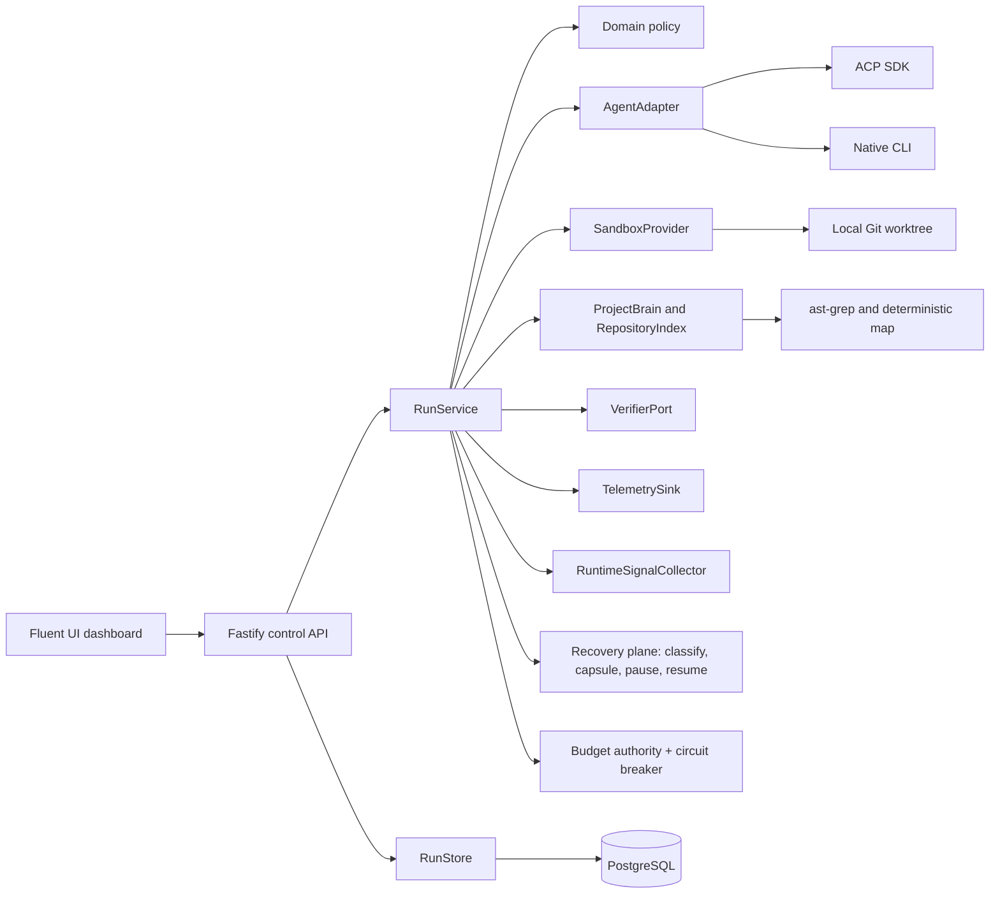

# Architecture

The harness is a modular TypeScript monolith. It deliberately wraps native coding agents instead
of replacing their planning, search, context management, or provider-specific capabilities.

## Dependency rule

`src/domain` has no framework imports. `src/application` coordinates domain ports. Fastify,
PostgreSQL, Git, process execution, SDKs, and external HTTP services live under `src/infrastructure`
or `src/server`. This keeps use cases testable with in-memory adapters.

## Core run flow

1. `RunService` persists a task and a `PROPOSED` run.
2. `AdaptiveModeController` starts with `GUIDED` unless a mode was explicitly requested.
3. `LocalWorktreeSandbox` creates a detached Git worktree at the requested revision.
4. `RepositoryIndex` and `ProjectBrain` build a small task-specific context.
5. A capability-preserving `AgentAdapter` runs the native agent.
6. `RuntimeSignalCollector` updates evidence snapshots at context, tool-event, diff, and verification
   checkpoints; the controller may change mode without altering the agent's native planning loop.
7. The harness captures an attempt-linked candidate diff and artifact.
8. `CommandVerifier` moves the candidate through `VERIFYING`. A failure may start one bounded repair
   with structured verifier evidence; every new candidate and verification is persisted.
9. Only a trusted verifier pass moves output to `VERIFIED`; exhaustion remains `QUARANTINED`.
10. Telemetry records cost, tokens, retry, latency, mode, changed files, verification, and adaptive
   signal dimensions.
11. Worktree retention is applied and `SandboxFinalized` is emitted.

Downstream mission nodes can consume only `VERIFIED` outputs.

## Agent adapters

- `ACPAdapter` uses the official stable ACP TypeScript SDK over NDJSON stdio. ACP keeps its native
  streamed updates and session identity. File callbacks are constrained to the sandbox path.
- `NativeCliAdapter` runs any NDJSON-capable native CLI without normalizing away its planning or
  context loop.
- `ClaudeCodeAdapter` consumes Claude Code's native stream-json output and preserves reported usage,
  cost, tool events, and cancellation.
- `APIAgentAdapter` is the API-agent extension point.

The fixture agents prove the native CLI and ACP paths without external credentials.

## Adaptive modes

- `STRICT`: narrow deterministic execution after scope stabilization — bounded initial scope,
  minimal context, suited to mechanical known-scope work.
- `GUIDED`: default compact verified starting context with unrestricted native repository search.
- `SOLO_NATIVE`: coherent native investigation for uncertain or highly coupled work; MAF remains
  outside as observer/controller/verifier.

### Desired versus effective mode

A run tracks `desiredMode` (what the adaptive policy wants) separately from `effectiveMode` (what
is actually enforced on the current or next agent session). `executionMode` is a compatibility
mirror of `effectiveMode` and never shows unenforced desired state. Decisions are computed against
the desired mode; enforcement moves the effective mode only with evidence:

- `ModeChangeRequested` records intent with the planned enforcement strategy.
- `ModeChanged` records enforcement with `enforcement.method` and evidence.

Enforcement strategies (deterministic planner in `src/domain/policy-enforcement.ts`):

1. `SESSION_BOUNDARY` — no session is active; the next session starts under the new policy,
   with a context rebuilt for the new mode (`ContextRebuilt`).
2. `LIVE_UPDATE` — the agent declares `livePolicyUpdate`; the harness delivers a policy update to
   the running session and the mode becomes effective only after the session emits a matching
   `policy` acknowledgement event.
3. `SAFE_RESTART` — only for broadening transitions while a session is active, only when the agent
   declares `safeSessionRestart`, and bounded by `maxPolicyRestarts`; the session is restarted from
   the existing workspace with a rebuilt context and a continuation message.
4. `DEFERRED_BOUNDARY` — everything else; the change applies at the next safe execution boundary.
   Tightening transitions never restart a running session.

Every enforcement is a persisted `ModeChanged` event with `from`, `to`, `reason`, structured
evidence, enforcement method + evidence, the triggering signal-snapshot ID, evidence IDs, and
timestamp. Signals include dependency and context expansion, touched modules, resolved
cross-module import edges, changed files, verification failure history, uncertainty, scope
stabilization, and mechanical remaining work. `STRICT` is reversible when deltas from its entry
snapshot invalidate stabilization. Three observations of cooldown block immediate re-narrowing or
cumulative-signal escalation after a transition; explicit new evidence may still leave `STRICT`
immediately.

## Project Brain

`ProjectBrain` separates `FACT`, `INFERENCE`, `EVIDENCE`, and `DECISION`. A fact without evidence is
rejected. Records from a different source revision become `STALE`.
`OptionalCodebaseMemoryIndex` is an explicitly inactive optional port until a configured MCP/service
transport exists; its status exposes the deterministic local fallback and never claims a hidden
daemon connection.

## Project Graph: bounded incremental indexing

`RepositoryIndex.index()` is a cheap, unbounded, path-only pass — every tracked file (up to a
100 000-file safety ceiling, with an honest `filesTruncated` flag rather than a silent slice) plus
package/module ownership derived from paths alone. No file content is read, so it is safe to call
on every task regardless of repository size. `RepositoryIndex.indexScope()` performs the bounded,
expensive part — parsing symbols and resolved local `IMPORTS` relations for exactly the requested
files — and caches each file's parse by content digest so repeated calls during a run only do new
work for files that changed or were never seen before.

`RunService` selects an initial scope from the cheap snapshot (via `ContextBuilderPort`, using only
module/path data), scope-indexes exactly that scope, and re-renders the context with real symbols.
As the agent touches new files (tool events, diffs), `RunService` incrementally scope-indexes any
newly referenced files not yet parsed and grows the same snapshot instance; the enlarged snapshot
is threaded into subsequent `RuntimeSignalCollector` observations, so dependency-expansion and
cross-module-edge signals reflect real resolved relations for whatever has actually been touched,
never a frozen initial slice.

Package (`packageOwnership`) and architectural module (`moduleOwnership`) are tracked separately.
A package/workspace root (`workspaces`, simple pnpm workspace entries, `apps/*`, `packages/*`, and
`services/*`) is the outer unit; a `src/<layer>` or `src/features/<name>` convention within that
package forms a deeper architectural module (e.g. package `apps/web`, module
`apps/web/src/domain`), falling back to the package root when no such convention applies.
Relationship kinds stay deterministic: `IMPORTS` requires both a real resolved local specifier and
the target file to exist in the repository snapshot. Nothing derived from agent-claimed data is
ever labeled deterministic.

## Recovery plane

Failure may interrupt progress; it must not destroy trustworthy progress. `src/domain/recovery.ts`
is pure domain logic: `classifyFailure` deterministically pattern-matches an error against a
`FailureClassification` taxonomy (`PROVIDER_TRANSIENT`, `PROVIDER_DEGRADED`, `RATE_LIMIT`,
`NETWORK_FAILURE`, `CREDENTIAL_FAILURE`, `AGENT_FAILURE`, `VERIFICATION_FAILURE`,
`ENVIRONMENT_FAILURE`, `BUDGET_EXHAUSTED`, `USER_INTERRUPT`, `REVISION_CONFLICT`,
`UNKNOWN_FAILURE`), defaulting honestly to `UNKNOWN_FAILURE` rather than guessing. Only a narrow
set of classes (`PROVIDER_TRANSIENT`, `PROVIDER_DEGRADED`, `RATE_LIMIT`, `NETWORK_FAILURE`,
`AGENT_FAILURE`) are auto-retryable; everything else requires explicit resume or escalation.

`RunService` wraps every agent attempt in a bounded recovery loop: an auto-retryable failure gets
one new bounded session (never a resume into the session that just failed) up to
`maxRecoveryAttempts` per run. Anything that exhausts retries, or is not auto-retryable, propagates
to `execute()`'s outer catch, which builds a `RecoveryCapsule` — run/task identity, goal, base and
resolved revision, workspace path, agent/provider/mode state, cost spent, candidate lineage, the
strongest verified candidate, verified facts/decisions, and the classified failure reason — and
persists it durably (`RunStore.saveRecoveryCapsule`) before moving the run to `PAUSED`. A capsule
never carries hidden chain-of-thought, only already-structured evidence the system already tracked.
`PAUSED` carries strictly more information than a bare `FAILED` and is used whenever a capsule was
successfully captured; `FAILED` is reserved for the rare case where capsule-building itself fails.

Candidate lineage (`candidateLineage`, `strongestCandidate`) is reconstructed read-only from
already-persisted artifacts and verifications — nothing is ever deleted, so a failed later repair
can never cause an earlier better-verified candidate's *identity and verification result* to be
forgotten. This is a metadata-level guarantee, not a content one: the full diff for a candidate is
only durably stored as a preview truncated to `maxDiffPreviewChars` (12,000 characters by default),
and the worktree's on-disk files reflect only the latest attempt. If a stronger earlier candidate's
diff exceeded that preview and a later, worse attempt has since overwritten the working tree,
`strongestCandidate` still correctly identifies *which* candidate was strongest, but reapplying its
full content is not guaranteed — physical workspace rollback is not implemented.

`RunService.resume()` restarts a `PAUSED` run from its capsule in the preserved worktree (default
retention keeps any non-`VERIFIED` sandbox). Before trusting prior evidence it re-resolves the
capsule's requested revision in the *source* repository and compares it against what the capsule
recorded when it was captured — the frozen worktree cannot itself drift, so the conflict to detect
is the source repository moving on while the run was paused. A mismatch refuses to resume
(`REVISION_CONFLICT`) rather than silently continuing on stale ground.

`RunService.emergencyStop()` cancels every active run — preserving worktrees, evidence, and
candidate lineage exactly as a normal cancellation does — and blocks new run creation until
`resumeNewRuns()` is called. It is a pause, never a wipe.

Explicitly not implemented, stated rather than overclaimed: automatic reload/resume of `PAUSED`
runs after a server process restart (capsules persist across a restart when using the PostgreSQL
store; nothing yet re-triggers resume automatically), and provider/model failover beyond a new
session on the same configured adapter (only one native adapter is wired today).

## Budget authority

`src/domain/budget.ts` is pure domain logic. A task may carry an optional `budget: { mode, limitUsd }`;
absent means fully permissive — nothing to enforce, and every authorization check trivially passes.
`computeAllocation` splits a configured limit into `execution`/`verification`/`recovery` reserves
(default 60/25/15%) so a runaway execution can never consume the money reserved for mandatory
verification or bounded recovery; `authorizeSpend` checks one category's remaining reserve against
its recorded spend (mapped from the existing `CostBreakdown` fields — no new cost tracking was
needed). `ADVISORY` mode never blocks, only reports an overrun; `HARD` mode blocks once a category's
reserve is exhausted. An unconfigured budget or an unauthorized-but-advisory spend is reported as
`null`/`false`, never as `$0` or a silent pass.

`RunService` enforces three gates: before the very first agent session (refuses to start at all —
the M4C "do not execute" strategy — if even the execution reserve cannot fund it, going straight to
a `BudgetExhaustedError`-classified capsule and `PAUSED`), before each bounded repair attempt
(stops repairing — never upgrades the last verification result, so budget reduces scope without
ever silently reducing trust), and before each bounded recovery retry (skips the retry rather than
spending on it). `estimateFromHistory` produces a bounded cost range anchored to prior
cost-per-verified-success telemetry, with `MEDIUM` confidence — genuinely `null` (not a guess) when
no history exists yet. `BudgetAllocated` and `CostEstimated` events are emitted at run creation so
this is inspectable without a dedicated API surface.

Not yet implemented: literal request-level interception for CLI-spawned native agents (their own
provider calls happen inside the child process, outside MAF's process boundary — orchestration-level
gating, described above, is what is actually enforceable for this execution model); project-level
(cross-run, cumulative) budgets — today's budget is per-run only, matching the milestone's stated
minimum.

Cost accounting itself still ultimately depends on `costUsd` the agent process self-reports in its
`usage` events — the same trust boundary M3 already applies to agent-reported error text applies
here too, and enforcement (this milestone) is what actually gives that number teeth. A reported
value is sanitized before being trusted: negative, non-finite, or implausibly large (over
`maxPlausibleSingleEventCostUsd`, currently $1,000) single-event costs are rejected rather than
applied (visible via an `ImplausibleCostIgnored` event), which closes the two concrete abuse
shapes a bad value can cause — driving spend negative, or forcing an immediate self-inflicted
pause. It does **not** close, and cannot without an independently metered provider gateway, an
agent that simply always under-reports (e.g. always claims near-zero) to keep a HARD budget from
ever triggering. A poisoned cost figure also feeds `costPerVerifiedSuccess()` and therefore
`estimateFromHistory`'s range for future runs.

## Provider circuit breaker

`src/domain/circuit-breaker.ts`'s `ProviderCircuitBreaker` is deterministic threshold-and-cooldown
arithmetic — no model is ever consulted to judge provider health. States are `HEALTHY`, `DEGRADED`
(past a failure threshold but still attempting), `OPEN_CIRCUIT` (fast-fails every attempt),
`HALF_OPEN` (exactly one bounded probe attempt allowed once the cooldown elapses). `RunService`
checks `canAttempt()` before every agent-session attempt (initial or retry) and refuses immediately
— without ever calling the adapter — when the circuit is open, so an obviously failing provider is
not retried into the ground. Only provider/network-shaped failure classifications
(`PROVIDER_TRANSIENT`, `PROVIDER_DEGRADED`, `RATE_LIMIT`, `NETWORK_FAILURE`) count against a
provider's health — agent-code-quality or verification failures are a different concern with a
different owner and never affect the breaker. One breaker instance is shared across all runs in a
process, so a provider that just failed for a previous run starts the next run already `DEGRADED`.
A HALF_OPEN probe's outcome always releases its slot one way or the other — via `recordOutcome()`
when it's provider-health-relevant, or `releaseProbe()` when it isn't — so an ordinary agent
failure landing mid-probe can never permanently wedge the circuit open.

Honest applicability: because M3's `AgentReportedFailure` classifies every agent-reported error as
`AGENT_FAILURE` regardless of its text (agent output is never trusted to self-classify), a real
provider outage that a CLI-spawned native agent encounters *inside its own process* surfaces to
MAF as an ordinary agent error, not a provider-classified one — the breaker never sees it. In the
one-adapter-today reality, the breaker is genuinely exercised only by failures the harness/adapter
layer itself raises (e.g. `agent.start()` throwing before any agent process even exists to report
from). It is real, tested, and will matter as soon as a harness-mediated provider path (e.g. a
`ModelGateway`-backed adapter) exists; it does not yet protect against a real outage a CLI agent
silently absorbs and reports as its own failure.

## Task risk profiler and assurance planner

`src/domain/risk.ts` derives a `RiskVector` — ten independent dimensions
(`ReasoningDifficulty`, `CodeCoupling`, `BlastRadius`, `ArchitectureSensitivity`, `DebtRisk`,
`SecuritySensitivity`, `PerformanceSensitivity`, `OperationalSensitivity`, `NetworkBoundaryChanges`,
`DataConsistencyRisk`), never a collapsed scalar score. Each dimension carries a `level`
(`LOW`/`MEDIUM`/`HIGH`) and a `provenance`: `DETERMINISTIC` when derived from real repository
evidence (distinct modules/packages touched via M2's ownership maps, resolved cross-module
`IMPORTS` edges via M2's relations graph, a path-pattern match), `HEURISTIC` when only a weaker
path-pattern proxy is available and nothing matched (so the honest default is "probably not", not
a guessed level), and `INSUFFICIENT_EVIDENCE` for dimensions that have no deterministic source yet at a given stage
(`ReasoningDifficulty` always; `DebtRisk` only pre-execution, since M7A's declared-debt checker made
it `DETERMINISTIC` once a diff exists) — reported as such rather than guessed.
`CodeCoupling`/`BlastRadius`/`ArchitectureSensitivity` specifically degrade their own provenance
(`coverageProvenance` in risk.ts) based on how many touched files actually have module/package
ownership entries: full coverage stays `DETERMINISTIC`, partial coverage degrades to `HEURISTIC`,
and zero coverage (e.g. a migration- or infra-only diff, since M2's ownership maps only cover
parsed source files) becomes `INSUFFICIENT_EVIDENCE` — a confident "LOW" would otherwise
misrepresent having no visibility as having checked and found nothing. No model is ever called to
assess risk.

`src/domain/assurance.ts`'s `buildAssurancePlan` compiles a `RiskVector` plus the task's
`qualityPreference` (`FAST`/`BALANCED`/`HIGH`/`CRITICAL`, defaulting to `BALANCED`) into an
`AssurancePlan`: a deterministic rule table (not a model call) deciding which of nine checks
(`CORRECTNESS`, `INTEGRATION`, `ARCHITECTURE`, `DEBT`, `SECURITY`, `PERFORMANCE`, `CONCURRENCY`,
`RESILIENCE`, `INDEPENDENT_REVIEW`) are required, with a reason recorded for every check —
required or not, never silent. `CORRECTNESS` is always required (the existing trusted-verifier
baseline every candidate already goes through); higher risk or a higher quality preference expands
the required set (`RESILIENCE` is required by either `NetworkBoundaryChanges` or
`OperationalSensitivity` reaching `MEDIUM`, not network-boundary evidence alone); `INDEPENDENT_REVIEW`
only becomes required when `SecuritySensitivity` is `HIGH` *and* the preference is `CRITICAL` — the
M5A rule that a high-risk author must not be the sole judge of its own high-risk work. `HIGH` and
`CRITICAL` preferences are deliberately not treated identically everywhere: `HIGH` alone expands
only `INTEGRATION`, while `SECURITY`/`RESILIENCE` expand only at `CRITICAL` — forcing every
`HIGH`-preference task through a security check regardless of actual risk would defeat "a small,
low-risk change gets a small plan."

`RunService` computes and emits both twice per run, as `RiskProfiled`/`AssurancePlanned` events so
the plan is inspectable evidence, never a hidden internal value: once right after `ContextBuilt`,
from the context builder's selected `initialFiles` (a pre-execution estimate — the only thing
available before any diff exists), and again from the actual diff's `changedFiles` after
`captureCandidate` resolves one (ground truth, refining the estimate with what was actually
touched rather than what was expected to be). M9's diff-captured vector additionally scans concrete
DB/query, pagination/index, network, bundle, serialization, payload, hot-path, and memory signals;
ordinary work with no such evidence remains LOW rather than being labeled performance-sensitive.

Two of the plan's checks gained deterministic checkers at M7, both reading the candidate's own
unified diff (parsed by `src/domain/diff-parse.ts`): `DEBT` (M7A) — `src/domain/debt.ts` counts
word-bounded declared-debt markers (`TODO`/`FIXME`/`HACK`/`XXX`) in the diff's added vs removed
lines of source files; net ≤ 0 passes, a small positive delta warns, and net ≥ 5
(`DEBT_FAIL_THRESHOLD`) fails. At the diff-captured stage the same counts feed `DebtRisk`
(`DETERMINISTIC`; net ≥ 2 `MEDIUM`, ≥ 5 `HIGH`), which is what makes the plan require `DEBT`.
`ARCHITECTURE` (M7B) — `src/domain/architecture.ts` enforces the layering rule that `src/domain`,
the innermost layer, must not add an import resolving outside itself; a violation is reported as
`FAIL` on the Architecture quality dimension whether or not the plan required the check, though
gating still follows the plan's decision. Both checkers analyze added lines only — a removed
violation or a paid-down marker is improvement, not a new finding.

`SECURITY` gained its checker at M8A: `src/domain/security.ts` scans the diff's added lines (all
file types — secrets live in `.env`/yaml/json, not just source) for credential patterns, in both
quoted source form and unquoted `.env`/yaml `key=value` form. A match against a structured secret
format (AWS permanent/temporary access key ID, GitHub/Slack token, private key block) in a
production file is
deterministic evidence of a leak — `FAIL` on the Security quality dimension, reported whether or
not the plan required the check, and (uniquely among the dimensions) gating unconditionally: plan
requirements are path-keyword heuristics, and a leak written to an unkeyworded path must not pass
the gate on that technicality. Structured matches
confined to test/fixture files and generic literal assignments to credential-shaped names in
production files are `WARN` (checked, flagged); dummy credentials confined to tests pass with
disclosure; placeholders and references (`process.env.*`, `${...}`, `<...>`) are not literals.
Every finding is redacted before it becomes evidence — prefix + `…(redacted)` — and two further
layers guard the harness's own records. `redactSensitiveData` is applied to untrusted event,
verifier, hint, and telemetry values: secret-shaped keys are replaced wholesale unless their value
is a validated `credential://` locator or known capability label, structured token formats and
generic credential assignments (including config namespaces, quoted/template passphrases, Go
short assignments, and YAML block scalars) are replaced
in strings, and an entire PEM private-key
block (header, unsigned body, and footer) is suppressed as one unit. Its search expressions are
stateless; repeated values and adjacent files cannot influence one another through `RegExp.lastIndex`.
The persisted artifact preview, repair prompt, and independent-review prompt are built with
`redactPatchPreview`, which suppresses every added line of each file whose additions carry
credential-shaped content. Token-only redaction is insufficient for a private key because its body
lines have no standalone signature. Uninspectable `GIT binary patch` payloads are also removed from
the persisted preview rather than retained in reversible form. The Security quality dimension for
such a candidate is `NOT_CHECKED`, not PASS. Gitlink and rename/copy-only changes receive the same
honest state because their complete destination bytes are not present in the patch; when the
assurance plan requires Security, that state blocks promotion. The composed agent → diff →
artifact/event/telemetry/API path is regression-tested
with consecutive and encrypted private-key files, inline and repeated credential assignments,
binary/uninspectable diffs, raw verifier output, adversarial filenames and references, mode reasons,
and secret-bearing task/error text. Recovery capsules retain candidate identity and digest metadata
rather than diff-preview content, and sanitize their goal, failure detail, facts, decisions, and
operational locators. Create/resume reject raw agent credential inputs and create rejects
secret-bearing durable locators. These controls reduce retention in known harness persistence
paths; they do not prove that arbitrary native agent processes, external verifier commands, or
sandbox files cannot disclose a secret outside the harness. `Security` joined the gated dimensions
at M8B.

`PERFORMANCE` gained its M9 checker without pretending code inspection is a benchmark.
`src/domain/runtime-graph.ts` derives a Runtime Graph distinct from M2's Project Graph and emits it
as candidate/digest-bound evidence; only topology and edge attributes present in changed paths/code
are represented, while timeout/retry/auth/rate-limit/payload/consistency properties remain null when
unknown. Nodes require content evidence (SQL shapes, named technologies like redis/s3, actual
fetch/axios calls) — filenames and generic identifiers (`cache.ts`, a local `Map`, `fs.writeFile`,
a variable named `database`) do not fabricate deployment topology. A server-side network call
becomes ownership-unknown `SERVICE` unless the diff explicitly
identifies an external API; a URL alone does not prove organizational ownership. Sensitivity
signals are calibrated so one ubiquitous weak line (a lone `JSON.parse`) stays LOW, while
removing query bounds/schema structure counts as evidence even though only removed lines changed.
When the plan
requires Performance, `CommandPerformanceVerifier` runs one project-supplied
bounded numeric command in an ephemeral detached baseline worktree and the candidate worktree for a
bounded sample count. `src/domain/performance.ts` compares the measured delta against the task's
`maxRegressionPercent`. Missing infrastructure/specification, command failure, dirty or mismatched
baseline, zero/non-finite metrics, stale candidate/digest binding, or benchmark workspace mutation
is `NOT_CHECKED`, never PASS; required `NOT_CHECKED` and measured FAIL both gate promotion. Plan-
exempt ordinary work does not run the command. `ReasoningDifficulty` remains `INSUFFICIENT_EVIDENCE`
for every run until a real source exists (nothing is planned yet for it).

`RESILIENCE` gained its M10 checker. `src/domain/resilience.ts` derives which production-like failure
scenarios are relevant to a candidate deterministically from the diff's added code content only —
outbound dependency calls imply the network family (high latency, timeout, connection reset,
malformed upstream response, rate limiting), consistency-critical write paths imply duplicate
request, concurrent completion paths imply out-of-order response, and a plan requiring
`CONCURRENCY` forces the interleaving pair. Comments, filenames, and test/fixture/script paths are
not evidence. When no scenario is relevant, the verdict is a deterministic PASS (the diff itself
shows there is nothing to inject). When the plan requires Resilience and scenarios are relevant,
`CommandResilienceVerifier` runs one project-supplied trusted command once per scenario with
`MAF_RESILIENCE_SCENARIO` set, optionally bringing up and tearing down a bounded Docker Compose
environment (120s, no Kubernetes). The measurement is bound to the candidate id and diff digest;
the workspace digest is re-collected afterwards so any mutation invalidates the evidence. Missing
specification or verifier, stale binding, an unexecuted relevant scenario, or a failed scenario is
`NOT_CHECKED`/`FAIL`, never PASS, and both gate promotion. Evidence records verbatim that local
scenario execution is resilience evidence, not production verification. `DURABLE_VERIFIED`
additionally requires a MEASURED resilience PASS — the plan's relevant scenarios were actually
executed against this candidate and passed; a heuristic relevance-empty PASS (the diff shows
nothing to inject) caps the rung at `QUALITY_VERIFIED`. `CONCURRENCY` as a standalone check
remains pending and honestly UNKNOWN when required without one of the above signals.

## Codebase health ledger

M11's ledger (`src/domain/health.ts`) is a longitudinal record of structural and operational
observations — explicitly not a health "score". Three metric groups, each absent when unmeasured rather
than defaulted to a good value: structural (module/file counts, largest module, cross-module
`IMPORTS` edges via the M5 coupling counter, Tarjan-SCC import cycles, and successful-parse scope,
fingerprint, inventory/scope truncation, file-scan completeness, and an explicit
`BOUNDED_PATTERN_SCAN` relation basis), change (M7B architecture violations,
unsafe type escapes, skipped tests, added relative imports and keys visibly added inside
`package.json` dependency sections (excluding upgrades/reformats/section moves), source-only
lexically filtered complexity hotspots, conservative cross-file duplication relationships, and
explicit binary/gitlink/rename-copy uninspectable coverage),
and operational (tokens/retries/verifier failures per task from the telemetry window, tool calls
and context size only when every record in the window carries them, frontier escalation rate — the
share of tasks that needed strict re-expansion — and the model mix, recorded as correlation
evidence without inferring model strength from a name).

`RunService` appends one project-scoped sample per trusted-verifier-passing run (structural from the
frozen pre-execution base-revision scope, change from the verified candidate's diff, operational from the last 50 same-project telemetry records when the sink can
list them — `DomainTelemetryRecorder` and the PostgreSQL sink can; a sink that cannot leaves the
group absent and the trend honestly incomplete). `healthLedger()` returns the last 20 samples for
one opaque project identity plus
the trend between the last two consecutive samples and a maintenance proposal: one evidence-backed
reason per materially degraded candidate-change or operational dimension, with numbers, and an
escalation-correlation note when they coincide. A single sample is a baseline, not a trend — trend
and maintenance are absent until a second sample exists. Samples from different projects are never
compared. Because project ordering does not prove Git ancestry or merging, every structural
direction stays `UNKNOWN`; raw structural observations remain visible for a future lineage-aware
repository-state basis. Per-change additions remain deltas rather than cumulative totals, and
neutral repository or package growth is `UNKNOWN` rather than an invented health direction. Samples persist via
`RunStore` (`saveHealthSample`/`listHealthSamples`, migration 006) with project/run/revision/time row
bindings validated against the JSON payload and an existing completed VERIFIED run, matching DIFF
artifact/digest/resolved-base metadata, and candidate-linked VERIFIED verification. Finding evidence is bounded and
redacted at derivation, RunService, store, and API boundaries. Every sample is exposed at
`GET /api/v1/health-ledger`, candidate/digest/resolved-base-revision bound, and labeled
`VERIFIED_CANDIDATE`, `BASE_REVISION`, and `VERIFIED_CANDIDATE_DIFF`;
it is a pre-merge candidate observation, never a claim that the change was merged or deployed.

## Durable state

PostgreSQL stores tasks, runs, events, artifacts, verifications, mode transitions, project knowledge,
credential references, telemetry, runtime-signal snapshots, user/session records, mission graph
state, and codebase-health samples. Tests use in-memory ports. Numbered migrations live under
`migrations/` and run in order.

## Mission tree and project graph

`MissionTree` represents work flow, while `RepositoryIndex` represents code dependency flow.
`VerificationState` is the trust flow. `split`, `merge`, `promote`, and `collapse` are domain
operations. Dependency gates require `VERIFIED` state, regardless of an agent claiming completion.

## Replaceable upstream boundaries

Bifrost, Nango, Agent Vault, Langfuse, codebase-memory-mcp, and future Unkey deployment stay behind
ports or HTTP/protocol adapters. Controllers do not import vendor-specific modules. Exact audited
versions, licenses, and update procedures are in [docs/UPSTREAMS.md](docs/UPSTREAMS.md).
